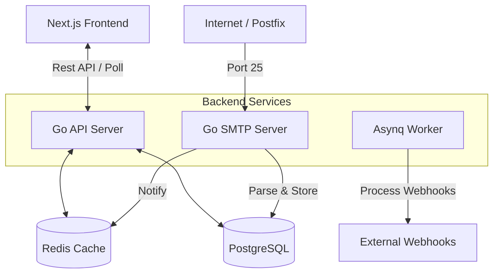

<div align="center">
  
  <span style="font-size: 80px; margin: 0 20px;">+</span>
  
  
  <h1>TempMail</h1>
  <p>
    <strong>High-Performance Self-Hosted Disposable Email Service</strong>
  </p>
  
  <p>
    <a href="https://github.com/Start-Indie/tempmail-pro/actions"></a>
    
    
    
  </p>
</div>

---

## 🎥 Demo
https://github.com/user-attachments/assets/c22cf17b-a8b5-4993-865c-26c92bfaa426


---

## 📖 Overview
**TempMail** is a modern, privacy-focused disposable email service engineered for performance and scalability. It combines the raw speed of a **Go backend** (handling SMTP & API) with a responsive, real-time **Next.js frontend**.

Unlike wrappers around external APIs, this is a **full-stack solution** that runs its own SMTP server to receive real emails directly from the internet.

## 🏗️ Architecture
The project follows a clean **Monorepo** structure:



### Tech Stack
-   **Backend**: Go (Golang), Gin (HTTP), Go-SMTP, Asynq (Redis Queue).
-   **Frontend**: Next.js 14 (App Router), TypeScript, Tailwind CSS, SWR.
-   **Data**: PostgreSQL (Metadata), Redis (Hot Cache & Queues).
-   **Ops**: Docker, Docker Compose, GitHub Actions.

---

## 🚀 Getting Started

### Prerequisites
-   **Docker** & Docker Compose
-   **Go 1.21+** (for local backend dev)
-   **Node.js 18+** (for local frontend dev)

### 1. Start Infrastructure
Spin up the database and cache instantly:
```bash
make up
# Functionally equivalent to: docker-compose up -d
```

### 2. Run Backend
The backend handles the API (Port 8080) and SMTP (Port 25/2500):
```bash
cd backend
go mod download
go run cmd/server/main.go
```

### 3. Run Frontend
The frontend provides the user interface (Port 3000):
```bash
cd frontend
npm install
npm run dev
```
Visit **[http://localhost:3000](http://localhost:3000)** to see it in action! 🎉

---

## 🧪 Testing Email Reception (Locally)
Since you likely don't have a domain pointed to localhost for real emails, use our simulation tool:

1.  Open the App and click **"Generate"** to get an address (e.g., `user@temp.com`).
2.  Open a new terminal:
    ```bash
    cd backend
    go run ../tools/email-sender/main.go
    ```
    *(Ensure the tool targets the generated address)*
3.  Watch the email appear instantly in the Inbox!

---

## 📦 Deployment
We provide a production-ready Docker Compose setup.

### Quick Deploy (VPS)
```bash
# 1. Create .env file with secrets
# 2. Build & Run
docker compose -f docker-compose.prod.yml up -d --build
```

**Requirements**: A VPS where **Port 25** is open (e.g., Hetzner, Vultr).
See the full **[Deployment Guide](DEPLOYMENT.md)** for details.

---

## 🛠️ DevOps Concepts
This project implements modern DevOps best practices:

### 1. Monorepo Architecture
-   **Structure**: Both `backend` (Go) and `frontend` (Next.js) reside in a single repository for unified versioning and easier code sharing.
-   **Tooling**: Root-level `Makefile` and `docker-compose` orchestrate the entire workspace.

### 2. Containerization (Docker)
-   **Multi-Stage Builds**: We use multi-stage Dockerfiles to keep images tiny.
    -   *Go*: Builds on `golang:1.23`, runs on `alpine:3.19` (Binary only).
    -   *Next.js*: Builds with all deps, runs with `standalone` output (No `node_modules` bloat).
-   **Optimization**: Layer caching is utilized to speed up builds.

### 3. CI/CD Pipeline (GitHub Actions)
-   **Automated Testing**: Every push triggers:
    -   Backend: `go test`, `go vet`, and build verification.
    -   Frontend: Linting (`eslint`) and build check.
    -   Docker: Verifies that container images build successfully.
-   **Infrastructure as Code (IaC)**: The entire infrastructure (services, networks, volumes) is defined in `docker-compose.prod.yml`.

---

## 📂 Project Structure
```bash
.
├── backend/            # Go Backend Code
│   ├── cmd/server      # Entrypoint
│   ├── internal/       # Core Logic (API, SMTP, Models)
│   └── Dockerfile      # Backend Container
├── frontend/           # Next.js Frontend Code
│   ├── src/app         # App Router Pages
│   └── Dockerfile      # Frontend Container
├── tools/              # Utilities (Email Sender, Webhook Tester)
├── docker-compose.yml  # Dev Infrastructure
└── Makefile            # Orchestration Commands
```

## 🤝 Contributing
1.  Fork the repo.
2.  Create a feature branch (`git checkout -b feature/amazing`).
3.  Commit changes.
4.  Open a Pull Request.

---

<p align="center">Made with ❤️ by Hardik Sharma</p>
